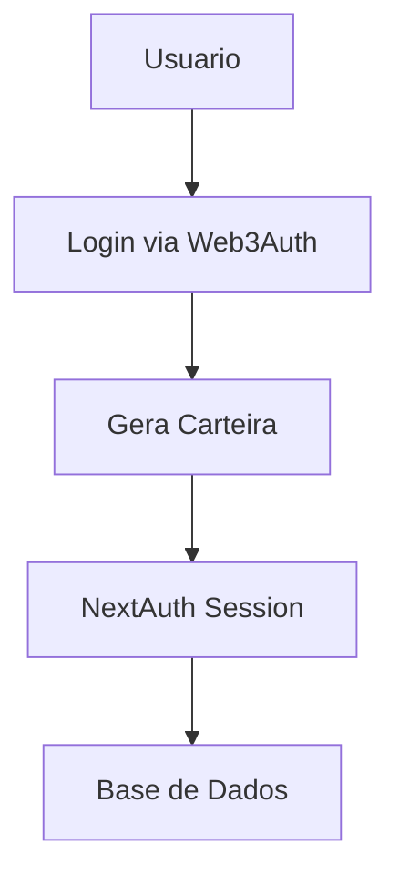

# 📚 Guia Oficial: Integração do Web3Auth com React (e Next.js)

## 📌 Visão Geral

O Web3Auth oferece um SDK React simples e poderoso para login com:

- ✉ E-mail (Magic Link)
- 🔐 Autenticação Social (Google, Twitter, GitHub, Discord, etc.)
- 🔑 Login com Carteira (wallet auto-gerada)
- ✅ Multi-Fator (MFA)
- ⚙️ Suporte direto a Ethereum, Solana e outros blocos Web3

Você cria e autentica carteiras automaticamente com lógica Web2–friendly, ideal para dApps com UX simplificada.

---

## ✅ Pré-Requisitos

- ✅ Projeto React (CRA, Next.js, Vite, etc.)
- ✅ Conta gratuita no Dashboard Web3Auth: https://dashboard.web3auth.io
- ✅ Node.js 16+ instalado
- ✅ Client ID obtido no dashboard após criar um projeto Web3Auth

---

## 📦 Instalação

Escolha seu gerenciador de pacotes:

Com npm:
```bash
npm install --save @web3auth/modal @web3auth/react @web3auth/base
```

Com yarn:
```bash
yarn add @web3auth/modal @web3auth/react @web3auth/base
```

---

## 🔧 Configuração

### 1️⃣ Crie o arquivo de configuração do Web3Auth

🔹 arquivo: web3authContext.tsx

```tsx
import { Web3AuthOptions, WEB3AUTH_NETWORK, WALLET_ADAPTERS, OPENLOGIN_NETWORK } from "@web3auth/base";
import { Web3AuthContextConfig } from "@web3auth/modal/react";

const web3AuthOptions: Web3AuthOptions = {
  clientId: "SUA_CLIENT_ID_DO_DASHBOARD", // ex: abc123...xyz
  web3AuthNetwork: WEB3AUTH_NETWORK.SAPPHIRE_MAINNET, // ou DEVNET
  chainConfig: {
    chainNamespace: "eip155",
    chainId: "0x89", // Polygon Mainnet
    rpcTarget: "https://polygon-rpc.com"
  },
  uiConfig: {
    appName: "Minha dApp Web3",
    appLogo: "https://seudominio.com/logo.png", // Opcional
  },
};

const web3AuthContextConfig: Web3AuthContextConfig = {
  web3AuthOptions,
};

export default web3AuthContextConfig;
```

---

### 2️⃣ Envolva sua aplicação com Web3AuthProvider

🔹 arquivo: main.tsx ou _app.tsx

```tsx
import { Web3AuthProvider } from "@web3auth/modal/react";
import web3AuthContextConfig from "./web3authContext";
import App from "./App";

function Root() {
  return (
    <Web3AuthProvider config={web3AuthContextConfig}>
      <App />
    </Web3AuthProvider>
  )
}
```

---

### 3️⃣ Crie Botão de Login com Web3Auth

🔹 arquivo: components/LoginButton.tsx

```tsx
import { useWeb3Auth } from "@web3auth/modal/react";
import { ethers } from "ethers";

export function LoginButton() {
  const { isConnected, connect, address } = useWeb3Auth();

  const handleLogin = async () => {
    const provider = await connect(); // Abre o modal
    const signer = new ethers.providers.Web3Provider(provider).getSigner();
    const userWallet = await signer.getAddress();

    console.log("Carteira do usuário:", userWallet);
    // → você pode salvar esse endereço no banco ex: via Prisma API/trpc
  };

  return (
    <button onClick={handleLogin}>
      {isConnected ? `Conectado: ${address}` : "Entrar com Web3Auth"}
    </button>
  );
}
```

---

## 🛠️ Configuração Avançada

Você pode personalizar:

### 🧑‍🔧 Métodos de login disponíveis:

```ts
modalConfig: {
  authMode: "DAPP",
  loginMethodsOrder: ["google", "twitter", "email_passwordless"],
  adapters: {
    openlogin: {
      settings: {
        network: "mainnet",
        loginConfig: {
          google: {
            name: "Google",
            verifier: "google-verifier-id",
            typeOfLogin: "google",
            clientId: "YOUR_GOOGLE_CLIENT_ID",
          },
          email_passwordless: {
            name: "Login por E-mail",
            verifier: "seu-verificador-email",
            typeOfLogin: "email_passwordless",
          },
        },
      },
    },
  },
}
```

### 🔐 MFA - Multi Factor Authentication

```ts
mfaLevel: "mandatory" | "optional" | "none"
```

---

## ⚡ Blockchain Compatibility

✅ Ethereum / EVM Chains (Polygon, BSC, Arbitrum...)  
✅ Solana  
✅ Avalanche  
✅ Suporte Custom RPCs (qualquer chain com endpoint RPC)

👉 Para Ethereum, você pode usar libraries como wagmi, ethers.js ou viem.

---

## 🧰 Exemplo de Integração Ethereum - ethers.js

```ts
const provider = new ethers.providers.Web3Provider(web3auth.provider);
const signer = provider.getSigner();
const address = await signer.getAddress();

const tx = await signer.sendTransaction({
  to: "0x1234...",
  value: ethers.utils.parseEther("0.001")
});
```

---

## 🧩 Solução de Problemas

### Erros comuns:

🚧 Erro: Buffer / process not defined

➕ Em Vite ou Next.js, adicione no webpack.config.js:

```js
resolve: {
  fallback: {
    buffer: require.resolve('buffer/'),
    process: require.resolve('process/browser'),
  },
}
```

🚧 JWT inválido (Custom verifiers):
- Verifique que o campo "verifier ID" corresponde ao ID configurado no Web3Auth Dashboard.

---

## 🪪 Recursos Úteis

- Dashboard Web3Auth: https://dashboard.web3auth.io
- Documentação oficial: https://web3auth.io/docs
- Repositório GitHub (SDK): https://github.com/Web3Auth/web3auth-core-sdk
- Exemplo completo React + Web3Auth: https://github.com/Web3Auth/web3auth-pnp-examples

---

## ✅ Conclusão

Com o Web3Auth, é possível oferecer login social com geração automática de carteira para Polygon (ou outras EVM chains), sem expor complexidade ou seed phrase ao usuário.

🚀 Ideal para dApps em escala com boa UX — como o PredIQ.fun.

---

## 🔗 Integração com T3 Stack

### 📊 Arquitetura Web3Auth + NextAuth



### Prisma Schema para Web3Auth + NextAuth

```prisma
model User {
  id            String    @id @default(cuid())
  email         String?   @unique
  name          String?
  web3authSub   String?   @unique    // ID único do Web3Auth
  walletAddress String?   @unique    // Carteira gerada
  createdAt     DateTime  @default(now())
  updatedAt     DateTime  @updatedAt
  
  // NextAuth relations
  accounts      Account[]
  sessions      Session[]
  
  // App relations
  predictions   Prediction[]
  comments      Comment[]
}

model Account {
  id                String  @id @default(cuid())
  userId            String
  type              String
  provider          String
  providerAccountId String
  refresh_token     String? @db.Text
  access_token      String? @db.Text
  expires_at        Int?
  token_type        String?
  scope             String?
  id_token          String? @db.Text
  session_state     String?

  user User @relation(fields: [userId], references: [id], onDelete: Cascade)

  @@unique([provider, providerAccountId])
}

model Session {
  id           String   @id @default(cuid())
  sessionToken String   @unique
  userId       String
  expires      DateTime
  user         User     @relation(fields: [userId], references: [id], onDelete: Cascade)
}
```

### Configuração NextAuth com Web3Auth

```typescript
// pages/api/auth/[...nextauth].ts
import NextAuth from "next-auth";
import { PrismaAdapter } from "@next-auth/prisma-adapter";
import { prisma } from "../../../server/db";

export default NextAuth({
  adapter: PrismaAdapter(prisma),
  providers: [
    // Seus providers existentes
  ],
  callbacks: {
    async session({ session, user }) {
      return {
        ...session,
        user: {
          ...session.user,
          walletAddress: user.walletAddress,
          web3authSub: user.web3authSub,
        },
      };
    },
    async jwt({ token, user }) {
      if (user) {
        token.walletAddress = user.walletAddress;
        token.web3authSub = user.web3authSub;
      }
      return token;
    },
  },
});
```

### Hook Custom para Gerenciar Ambos

```typescript
// hooks/useAuth.ts
import { useSession } from "next-auth/react";
import { useWeb3Auth } from "@web3auth/modal/react";
import { useState, useEffect } from "react";

export function useAuth() {
  const { data: session, status } = useSession();
  const web3auth = useWeb3Auth();
  const [isLoading, setIsLoading] = useState(true);

  useEffect(() => {
    const syncAuth = async () => {
      if (web3auth.connected && session) {
        // Já está sincronizado
        setIsLoading(false);
        return;
      }

      if (web3auth.connected && !session) {
        // Precisa sincronizar com NextAuth
        try {
          const userInfo = await web3auth.getUserInfo();
          const provider = web3auth.provider;
          const address = await provider.getAddress();
          
          // Criar/atualizar sessão NextAuth
          await signIn("credentials", {
            web3authSub: userInfo.sub,
            walletAddress: address,
            email: userInfo.email,
            redirect: false,
          });
        } catch (error) {
          console.error("Erro na sincronização:", error);
        }
      }
    };

    syncAuth();
  }, [web3auth.connected, session]);

  return {
    isLoading: isLoading || status === "loading",
    isAuthenticated: !!session && web3auth.connected,
    user: session?.user,
    wallet: web3auth.address,
    web3auth,
  };
}
```

### tRPC Router para Web3Auth + NextAuth

```typescript
// server/api/routers/auth.ts
export const authRouter = createTRPCRouter({
  linkWallet: protectedProcedure
    .input(z.object({
      walletAddress: z.string(),
      web3AuthId: z.string()
    }))
    .mutation(async ({ ctx, input }) => {
      return ctx.prisma.user.update({
        where: { id: ctx.session.user.id },
        data: {
          walletAddress: input.walletAddress,
          web3authSub: input.web3AuthId
        }
      });
    }),

  syncWeb3Auth: protectedProcedure
    .input(z.object({
      web3authSub: z.string(),
      walletAddress: z.string(),
      email: z.string().optional(),
      name: z.string().optional(),
    }))
    .mutation(async ({ ctx, input }) => {
      // Atualizar usuário com dados do Web3Auth
      return ctx.prisma.user.update({
        where: { id: ctx.session.user.id },
        data: {
          web3authSub: input.web3authSub,
          walletAddress: input.walletAddress,
          email: input.email,
          name: input.name,
        }
      });
    }),

  getUserWallet: protectedProcedure
    .query(async ({ ctx }) => {
      const user = await ctx.prisma.user.findUnique({
        where: { id: ctx.session.user.id },
        select: { walletAddress: true, web3authSub: true }
      });
      return user;
    }),
});
```

### Componente de Login Unificado

```tsx
// components/Web3AuthLogin.tsx
import { useWeb3Auth } from "@web3auth/modal/react";
import { useAuth } from "@/hooks/useAuth";
import { trpc } from "@/trpc/react";
import { Button } from "@/components/ui/button";
import { toast } from "sonner";

export function Web3AuthLogin() {
  const { web3auth } = useWeb3Auth();
  const { isAuthenticated, user, wallet } = useAuth();
  const syncWeb3Auth = trpc.auth.syncWeb3Auth.useMutation();
  
  const handleLogin = async () => {
    try {
      // 1. Login Web3Auth
      const provider = await web3auth.connect();
      const userInfo = await web3auth.getUserInfo();
      const address = await provider.getAddress();

      // 2. Sincroniza com NextAuth via tRPC
      await syncWeb3Auth.mutateAsync({
        web3authSub: userInfo.sub,
        walletAddress: address,
        email: userInfo.email,
        name: userInfo.name,
      });

      toast.success("Carteira conectada com sucesso!");
    } catch (error) {
      toast.error("Erro ao conectar carteira");
      console.error("Erro no login:", error);
    }
  };

  const handleLogout = async () => {
    try {
      await web3auth.logout();
      await signOut();
      toast.success("Desconectado com sucesso!");
    } catch (error) {
      toast.error("Erro ao desconectar");
    }
  };

  return (
    <div className="flex gap-2">
      {!isAuthenticated ? (
        <Button onClick={handleLogin} disabled={syncWeb3Auth.isLoading}>
          {syncWeb3Auth.isLoading ? "Conectando..." : "Conectar Carteira"}
        </Button>
      ) : (
        <div className="flex items-center gap-2">
          <span className="text-sm">
            {wallet?.slice(0, 6)}...{wallet?.slice(-4)}
          </span>
          <Button variant="outline" onClick={handleLogout}>
            Desconectar
          </Button>
        </div>
      )}
    </div>
  );
}
```

### Middleware de Proteção

```typescript
// middleware.ts
import { getToken } from "next-auth/jwt";
import { NextResponse } from "next/server";
import type { NextRequest } from "next/server";

export async function middleware(req: NextRequest) {
  const token = await getToken({ req });
  
  // Verificar se usuário tem carteira conectada
  if (!token?.walletAddress) {
    return NextResponse.redirect(new URL("/login", req.url));
  }

  return NextResponse.next();
}

export const config = {
  matcher: ["/dashboard/:path*", "/perfil/:path*", "/prediction/:path*"],
};
```

### Página de Dashboard com Integração

```tsx
// pages/dashboard.tsx
import { useAuth } from "@/hooks/useAuth";
import { trpc } from "@/trpc/react";

export default function Dashboard() {
  const { isAuthenticated, user, wallet, isLoading } = useAuth();
  const { data: userWallet } = trpc.auth.getUserWallet.useQuery();

  if (isLoading) {
    return <div>Carregando...</div>;
  }

  if (!isAuthenticated) {
    return <div>Redirecionando para login...</div>;
  }

  return (
    <div className="p-6">
      <h1 className="text-2xl font-bold mb-4">
        Bem vindo, {user?.name || user?.email}
      </h1>
      
      <div className="grid gap-4">
        <div className="p-4 border rounded-lg">
          <h2 className="font-semibold mb-2">Informações da Carteira</h2>
          <p className="text-sm text-gray-600">
            Endereço: {wallet || userWallet?.walletAddress}
          </p>
          <p className="text-sm text-gray-600">
            Web3Auth ID: {userWallet?.web3authSub}
          </p>
        </div>
        
        {/* Outros componentes do dashboard */}
      </div>
    </div>
  );
}
```

---

## 🎯 Benefícios da Integração Web3Auth + NextAuth

### ✅ Vantagens

1. **Sessão Unificada**: Uma única fonte de verdade para autenticação
2. **Persistência**: NextAuth cuida do token/cookie automaticamente
3. **DB Sync**: Prisma mantém tudo sincronizado no banco
4. **Segurança**: Middlewares funcionam normalmente
5. **SEO**: Server-side rendering funciona perfeitamente
6. **UX Simplificada**: Login social sem complexidade Web3
7. **Carteiras Automáticas**: Geração automática de carteiras
8. **Multi-Chain**: Suporte a Ethereum, Polygon, Solana

### ⚠️ Pontos de Atenção

1. **Ordem de Login**: Sempre Web3Auth → NextAuth
2. **Logout**: Precisa desconectar ambos sistemas
3. **Refresh Tokens**: Considerar refresh tokens para sessões longas
4. **Error Handling**: Tratar falhas em ambos sistemas
5. **Rate Limiting**: Implementar rate limiting para evitar spam
6. **Wallet Validation**: Validar endereços de carteira
7. **Session Expiry**: Gerenciar expiração de sessões

### 🔧 Configurações Adicionais

#### Rate Limiting com Upstash

```typescript
// lib/rate-limit.ts
import { Ratelimit } from "@upstash/ratelimit";
import { Redis } from "@upstash/redis";

const ratelimit = new Ratelimit({
  redis: Redis.fromEnv(),
  limiter: Ratelimit.slidingWindow(5, "1 m"), // 5 requests per minute
});

export async function checkRateLimit(identifier: string) {
  const { success } = await ratelimit.limit(identifier);
  return success;
}
```

#### Validação de Carteira

```typescript
// lib/wallet-validation.ts
import { ethers } from "ethers";

export function isValidWalletAddress(address: string): boolean {
  try {
    return ethers.utils.isAddress(address);
  } catch {
    return false;
  }
}

export function normalizeAddress(address: string): string {
  return ethers.utils.getAddress(address);
}
```

#### Gerenciamento de Sessão

```typescript
// hooks/useSessionManager.ts
import { useSession } from "next-auth/react";
import { useWeb3Auth } from "@web3auth/modal/react";
import { useEffect } from "react";

export function useSessionManager() {
  const { data: session, status } = useSession();
  const web3auth = useWeb3Auth();

  useEffect(() => {
    // Verificar se sessão expirou
    if (session?.expires && new Date(session.expires) < new Date()) {
      web3auth.logout();
    }
  }, [session]);

  return {
    isSessionValid: status === "authenticated" && web3auth.connected,
    session,
    web3auth,
  };
}
```

## 🚀 Exemplo de Implementação Completa

### 1. Setup Inicial

```bash
# Instalar dependências
pnpm add @web3auth/modal @web3auth/react @web3auth/base
pnpm add @upstash/redis @upstash/ratelimit
pnpm add ethers
```

### 2. Configurar Variáveis de Ambiente

```env
# .env.local
NEXTAUTH_SECRET=your-secret-key
NEXTAUTH_URL=http://localhost:3000

# Web3Auth
WEB3AUTH_CLIENT_ID=your-web3auth-client-id
WEB3AUTH_NETWORK=sapphire_mainnet

# Upstash Redis (para rate limiting)
UPSTASH_REDIS_REST_URL=your-redis-url
UPSTASH_REDIS_REST_TOKEN=your-redis-token
```

### 3. Deploy e Monitoramento

```typescript
// lib/analytics.ts
export function trackWalletConnection(userId: string, walletAddress: string) {
  // Implementar analytics
  console.log(`User ${userId} connected wallet ${walletAddress}`);
}

export function trackTransaction(userId: string, txHash: string) {
  // Implementar tracking de transações
  console.log(`User ${userId} made transaction ${txHash}`);
}
```

## 🎯 Próximos Passos

1. **Setup Web3Auth Dashboard** - Crie seu projeto
2. **Configure Provider** - Adicione Web3AuthProvider
3. **Integre com Prisma** - Salve dados da carteira
4. **Implemente Rate Limiting** - Proteja contra spam
5. **Teste Transações** - Implemente funcionalidades Web3
6. **Configure Analytics** - Monitore uso
7. **Deploy** - Configure variáveis de ambiente

Esta integração permite que usuários façam login social e tenham carteiras automáticas para participar dos prediction markets! 🚀 